# Laboratorio 3 - DOSW

**Integrantes:**
- Carolina Cepeda Valencia
- Manuel Alejandro Guarnizo Garcia
- Daniel Alejandro Rodriguez Baracaldo

**Nombre de la rama:**
"feature/lab3_Cepeda_Guarnizo_Rodriguez_2025-2"

---

# Retos completados
## Reto 1

### Reglas de negocio
* número de cuenta tiene exactamente 10 dígitos 
* el número de cuenta solo es válido si los primeros dos dígitos corresponden a un banco registrado. 
* No tiene letras ni carácteres especiales.
* El saldo del sueldo es positivo.
### Funcionalidades Principales
* crear las cuentas de los clientes.
* validar las cuentas de los clientes.
* permitir que los clientes realicen una consulta del saldo de su cuenta.
* permitir que los clientes hagan un depósito.

### Actores principales
* Clientes
* Bancos Registrados
* Bankify

### Precondiciones necesarias para el sistema
* Existencia de los bancos
* Clientes registrados en alguno de los bancos
* Fondos Monetarios

### Reto 2
### Diagrama de contexto

Tanto los clientes como bancos se apoyan en la aplicación según sus necesidades: los usuarios para
realizar operaciones básicas como consultar saldo o hacer transacciones, y los bancos para validar cuentas
y responder consultas en tiempo real. Así, Bankify se convierte en el punto de conexión que facilita y
asegura la comunicación entre ambos actores.
### Tabla historias de usuarios

Los clientes buscan principalmente funcionalidad y facilidad de uso (abrir cuentas, consultar saldo),
mientras que las empresas priorizan seguridad y confianza (validar cuentas, permitir depósitos de manera
controlada).

### Diagrama casos de uso

El cliente interactúa con opciones directas, mientras que Bankify se encarga de procesos 
más internos, relacionados con la validación y administración de cuentas.

### Diagrama de clases

Se colocaron los actores como Usuario, Cuenta, Banco y ademas sus clases que gestionan sus comportamientos
como AccountManager, AccountV, Bankify, de tal forma que se pueda cumplir con requisitos de negocio
como la longitud del número de cuenta, el uso de bancos autorizados y la prohibición de caracteres inválidos,
garantizando así la escalabilidad, mantenibilidad y seguridad del software.

### Reto 3
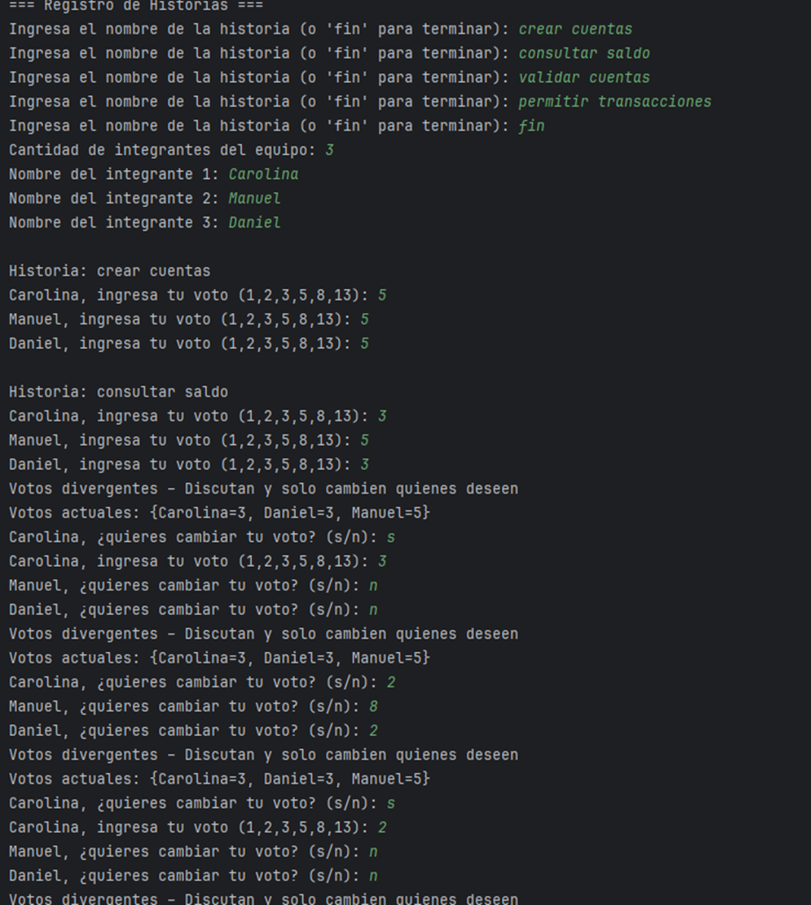

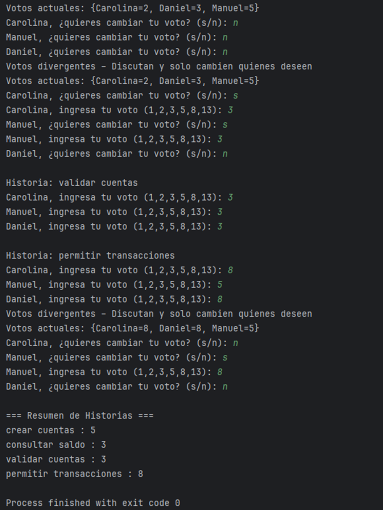

En la sesión se registraron cuatro historias: crear cuentas, consultar saldo, validar cuentas y permitir 
transacciones. Hubo consenso inmediato en crear cuentas (5) y validar cuentas (3). En consultar saldo se 
requirieron varias rondas hasta acordar 3, y en permitir transacciones se resolvió la diferencia de votos 
entre 5 y 8 llegando finalmente a 8.

### Reto 4 
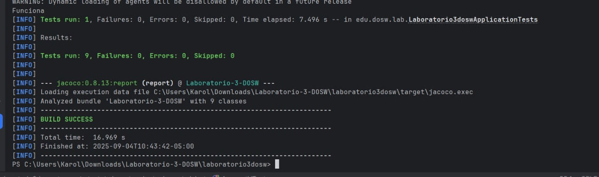

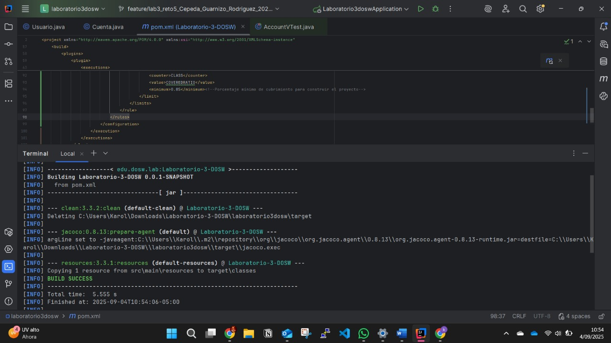

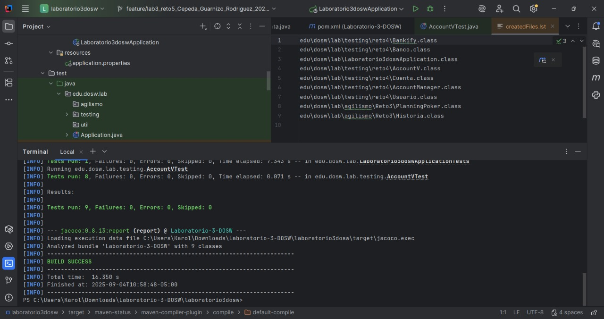

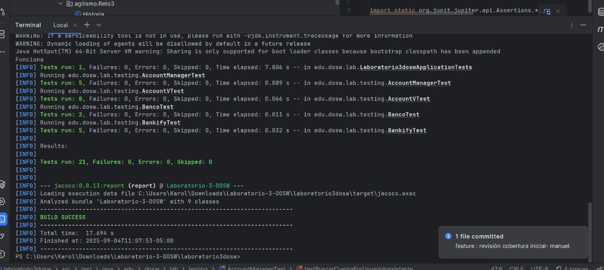

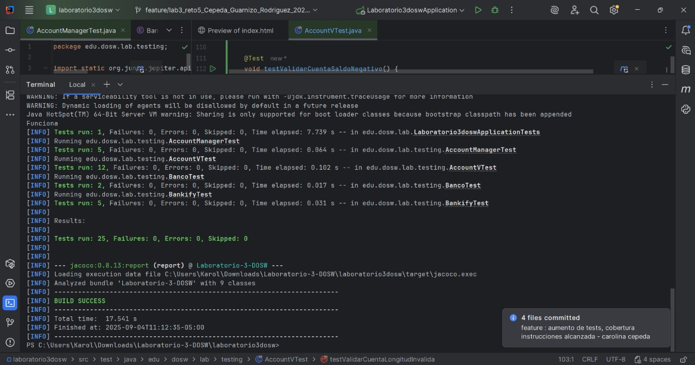

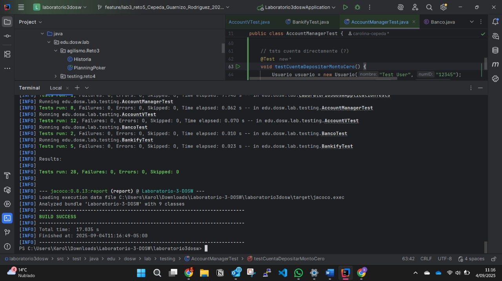

### Principios y Patrones Utilizados

### Principios

* Encapsulación (POO): Se definieron atributos privados y se muestra solamente lo necesario mediante getters y métodos controlados.
* Responsabilidad Única (SRP): Cada clase cumple un propósito único:

    * Cuenta maneja: operaciones básicas de una cuenta.
    * Usuario modela: la información del cliente.
    * AccountManager: gestiona las cuentas (crear, depositar, buscar).
    * AccountV: valida reglas de negocio de las cuentas.
    * Bankify: actúa como fachada para simplificar el acceso.

### Patrones

* Factory Method (implícito en AccountManager.crearCuenta): Se centralizó la creación de cuentas, permitiendo que todas tengan un número único y válido.
* Fachada (Bankify): Expone una interfaz unificada para crear, validar y consultar cuentas, ocultando la complejidad de AccountManager y AccountV.

### Reto 5

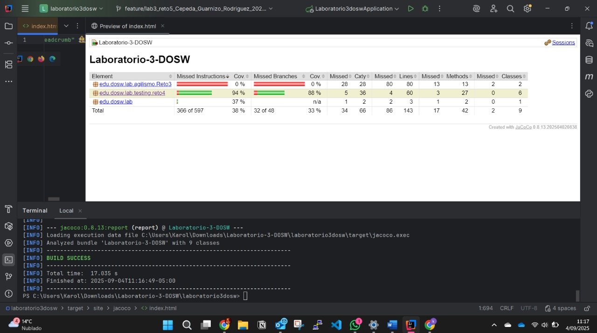

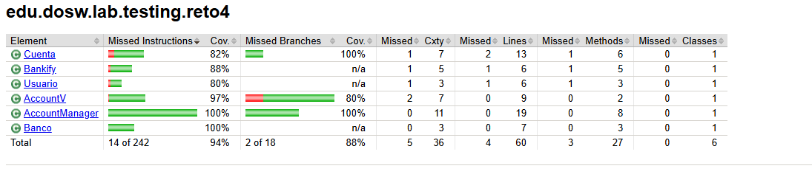

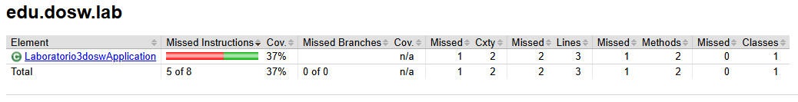
Se añadieron pruebas para cubrir condiciones alternas y ramas poco usadas en reto4, logrando 
superar el 85% de cobertura, asegurando asi tanto los casos comunes como los excepcionales estén verificados.
Ademas la cobertura de instrucciones fue de 38% y la de ramas de 33%.

Para mejorar la cobertura fue necesario incluir pruebas de escenarios negativos y casos límite.
Por ejemplo, depósitos de montos negativos o cero, validación de cuentas con longitud incorrecta 
o saldo negativo, búsqueda de cuentas inexistentes y manejo de valores nulos o vacios. Estos casos fueron importantes 
ya que nos permitieron cubrir ciertos casos que son vitales para la coherencia del programa y ademas
al usar mayor parte del codigo, hay un mayor cubrimiento.
### Reto 6

### Reflexion importancia de las pruebas en un software diseñado
Daniel: Las pruebas son de gran importancia ya que al estar diseñando un software, se debe tener una norma
la cual guie el sentido del proyecto, donde se especifique la estructura que deberia tener y de acuerdo a ello
se van desarrollando cada parte del proyecto, ademas el realizarlas tempranamente previene el realizar cambios
gigantescos en el futuro, evitando asi sobrecostes en el cumplimiento del software.

---

## Preguntas y Respuestas sobre Desarrollo Ágil, Testing y Calidad de Software

### A. Diferencia entre Pruebas Unitarias y Pruebas de Integración E2E
- **Pruebas Unitarias**: Se encargan de verificar el funcionamiento individual de métodos o clases de forma aislada, asegurando que cada componente opere correctamente por sí mismo de manera rápida y controlada, enfocandose en la lógica interna y detectando errores tempranos.
- **Pruebas de Integración E2E (End-to-End)**: Evalúan el comportamiento conjunto de múltiples componentes del sistema, simulando el flujo completo que seguiría un usuario real desde el inicio hasta el final de un proceso.

---

### B. Objetivo de la Sprint Retrospective en Scrum
La **Sprint Retrospective** es una reunión realizada al concluir cada sprint donde el equipo analiza lo que salió bien, lo que puede mejorarse y define acciones de mejora.  
Su importancia radica en que impulsa la **mejora continua**, mejora la comunicación, incrementa la eficiencia y permite al equipo adaptarse progresivamente a nuevos retos.

---

### C. Diferencia entre Épica, Feature e Historia de Usuario (Ejemplo: Netflix)

* Épica: es un objetivo grande que puede durar varios sprints y se divide en partes más pequeñas.

  Ejemplo: “Mejorar la forma en que los usuarios ven y disfrutan el contenido”*.
* Feature: es una función importante que ayuda a cumplir la épica.

  Ejemplo: “Agregar perfiles distintos para cada usuario”*.
* Historia de Usuario: es una necesidad concreta contada desde la visión del usuario.

  Ejemplo: “Como usuario quiero crear un perfil con mi nombre para guardar mis preferencias de películas y series”*.

---

### D. Importancia y Limitaciones de la Cobertura de Código (Code Coverage)

La cobertura de código mide el porcentaje de líneas que se ejecutan durante las pruebas y es útil para identificar áreas del sistema que no están siendo verificadas, pero alcanzar el 100% no significa que el software esté libre de errores, ya que no garantiza que se hayan probado todas las combinaciones de entradas, puede incluir pruebas que ejecuten código sin validar correctamente su comportamiento y no contempla posibles fallos de integración o una interpretación incorrecta de los requisitos.

---

### E. Diagramas de Casos de Uso
Un **Diagrama de Casos de Uso** ilustra las interacciones entre los **actores** (usuarios o sistemas externos) y el sistema en desarrollo.  
**Componentes principales**:
- Actores
- Casos de uso
- Relaciones (asociación, inclusión, extensión)
- Límites del sistema

Durante la fase de análisis, este facilita la comprensión y documentación de los requerimientos funcionales desde el punto de vista del usuario.Convierte necesidades en especificaciones precisas, detecta vacíos y alinea expectativas, estableciendo bases sólidas para el desarrollo.

---

### F. Diferencias entre JUnit, Jacoco y SonarQube
- **JUnit**: Framework diseñado para crear y ejecutar pruebas unitarias en Java.
- **Jacoco**: Herramienta que calcula el porcentaje de cobertura de código alcanzado por las pruebas.
- **SonarQube**: Plataforma integral que evalúa la calidad del software mediante métricas de cobertura, duplicación, complejidad y detección de vulnerabilidades.

---

### G. Beneficios del Planning Poker
- Fomenta la participación equitativa de todos los miembros del equipo.
- Minimiza la influencia de sesgos individuales en las estimaciones.
- Promueve la transparencia y el acuerdo colectivo en la planificación.
- Fortalece el compromiso del equipo al involucrar a todos en las decisiones de estimación.

---

### H. Valores Fundamentales de Scrum

1. **Compromiso:**  
   Los miembros del equipo se comprometen con los objetivos del sprint y con apoyarse mutuamente para alcanzar las metas comunes.

2. **Coraje:**  
   Los equipos deben tener la valentía para hacer lo correcto, abordar problemas difíciles y aceptar desafíos complejos con determinación.

3. **Enfoque:**  
   Concentrarse prioritariamente en las tareas del sprint y en los objetivos acordados, evitando distracciones y manteniendo la productividad.

4. **Apertura:**  
   Fomentar la transparencia en el trabajo, comunicar abiertamente los progresos y dificultades, y estar receptivo al feedback y la colaboración.

5. **Respeto:**  
   Valorar las habilidades, experiencias y contribuciones de cada miembro del equipo, creando un ambiente de confianza y trabajo colaborativo.

El valor mas complejo de implementar es el compromiso, ya que todo el equipo tiene que trabajar como uno, donde todos completen y agreguen tareas para el desarrollo, las cuales se deben realizar cumplidamente para evitar atrasos y solucionar errores desde un tiempo temprano.

---
## Evidencia commits realizados
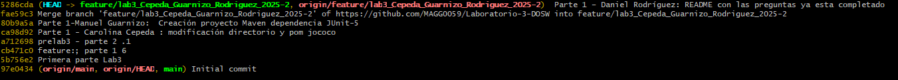

---