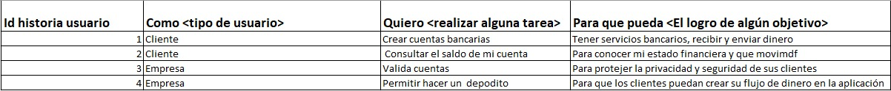

# Retos completados
## Reto 1

### Reglas de negocio
* número de cuenta tiene exactamente 10 dígitos 
* el número de cuenta solo es válido si los primeros dos dígitos corresponden a un banco registrado. 
* No tiene letras ni carácteres especiales.
* El saldo del sueldo es positivo.
### Funcionalidades Principales
* crear las cuentas de los clientes.
* validar las cuentas de los clientes.
* permitir que los clientes realicen una consulta del saldo de su cuenta.
* permitir que los clientes hagan un depósito.

### Actores principales
* Clientes
* Bancos Registrados
* Bankify

### Precondiciones necesarias para el sistema
* Existencia de los bancos
* Clientes registrados en alguno de los bancos
* Fondos Monetarios

### Reto 2

