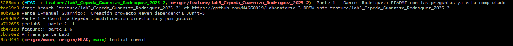

# Laboratorio 3 - DOSW

**Integrantes:**
- Carolina Cepeda Valencia
- Manuel Alejandro Guarnizo Garcia
- Daniel Alejandro Rodriguez Baracaldo

**Nombre de la rama:**
"feature/lab3_Cepeda_Guarnizo_Rodriguez_2025-2"

---

## Preguntas y Respuestas sobre Desarrollo Ágil, Testing y Calidad de Software

### A. Diferencia entre Pruebas Unitarias y Pruebas de Integración E2E
- **Pruebas Unitarias**: Se encargan de verificar el funcionamiento individual de métodos o clases de forma aislada, asegurando que cada componente opere correctamente por sí mismo de manera rápida y controlada, enfocandose en la lógica interna y detectando errores tempranos.
- **Pruebas de Integración E2E (End-to-End)**: Evalúan el comportamiento conjunto de múltiples componentes del sistema, simulando el flujo completo que seguiría un usuario real desde el inicio hasta el final de un proceso.

---

### B. Objetivo de la Sprint Retrospective en Scrum
La **Sprint Retrospective** es una reunión realizada al concluir cada sprint donde el equipo analiza lo que salió bien, lo que puede mejorarse y define acciones de mejora.  
Su importancia radica en que impulsa la **mejora continua**, mejora la comunicación, incrementa la eficiencia y permite al equipo adaptarse progresivamente a nuevos retos.

---

### C. Diferencia entre Épica, Feature e Historia de Usuario (Ejemplo: Netflix)

* Épica: es un objetivo grande que puede durar varios sprints y se divide en partes más pequeñas.

  Ejemplo: “Mejorar la forma en que los usuarios ven y disfrutan el contenido”*.
* Feature: es una función importante que ayuda a cumplir la épica.

  Ejemplo: “Agregar perfiles distintos para cada usuario”*.
* Historia de Usuario: es una necesidad concreta contada desde la visión del usuario.

  Ejemplo: “Como usuario quiero crear un perfil con mi nombre para guardar mis preferencias de películas y series”*.

---

### D. Importancia y Limitaciones de la Cobertura de Código (Code Coverage)

La cobertura de código mide el porcentaje de líneas que se ejecutan durante las pruebas y es útil para identificar áreas del sistema que no están siendo verificadas, pero alcanzar el 100% no significa que el software esté libre de errores, ya que no garantiza que se hayan probado todas las combinaciones de entradas, puede incluir pruebas que ejecuten código sin validar correctamente su comportamiento y no contempla posibles fallos de integración o una interpretación incorrecta de los requisitos.

---

### E. Diagramas de Casos de Uso
Un **Diagrama de Casos de Uso** ilustra las interacciones entre los **actores** (usuarios o sistemas externos) y el sistema en desarrollo.  
**Componentes principales**:
- Actores
- Casos de uso
- Relaciones (asociación, inclusión, extensión)
- Límites del sistema

Durante la fase de análisis, este facilita la comprensión y documentación de los requerimientos funcionales desde el punto de vista del usuario.Convierte necesidades en especificaciones precisas, detecta vacíos y alinea expectativas, estableciendo bases sólidas para el desarrollo.

---

### F. Diferencias entre JUnit, Jacoco y SonarQube
- **JUnit**: Framework diseñado para crear y ejecutar pruebas unitarias en Java.
- **Jacoco**: Herramienta que calcula el porcentaje de cobertura de código alcanzado por las pruebas.
- **SonarQube**: Plataforma integral que evalúa la calidad del software mediante métricas de cobertura, duplicación, complejidad y detección de vulnerabilidades.

---

### G. Beneficios del Planning Poker
- Fomenta la participación equitativa de todos los miembros del equipo.
- Minimiza la influencia de sesgos individuales en las estimaciones.
- Promueve la transparencia y el acuerdo colectivo en la planificación.
- Fortalece el compromiso del equipo al involucrar a todos en las decisiones de estimación.

---

### H. Valores Fundamentales de Scrum

1. **Compromiso:**  
   Los miembros del equipo se comprometen con los objetivos del sprint y con apoyarse mutuamente para alcanzar las metas comunes.

2. **Coraje:**  
   Los equipos deben tener la valentía para hacer lo correcto, abordar problemas difíciles y aceptar desafíos complejos con determinación.

3. **Enfoque:**  
   Concentrarse prioritariamente en las tareas del sprint y en los objetivos acordados, evitando distracciones y manteniendo la productividad.

4. **Apertura:**  
   Fomentar la transparencia en el trabajo, comunicar abiertamente los progresos y dificultades, y estar receptivo al feedback y la colaboración.

5. **Respeto:**  
   Valorar las habilidades, experiencias y contribuciones de cada miembro del equipo, creando un ambiente de confianza y trabajo colaborativo.

El valor mas complejo de implementar es el compromiso, ya que todo el equipo tiene que trabajar como uno, donde todos completen y agreguen tareas para el desarrollo, las cuales se deben realizar cumplidamente para evitar atrasos y solucionar errores desde un tiempo temprano.

---
## Evidencia commits realizados

---